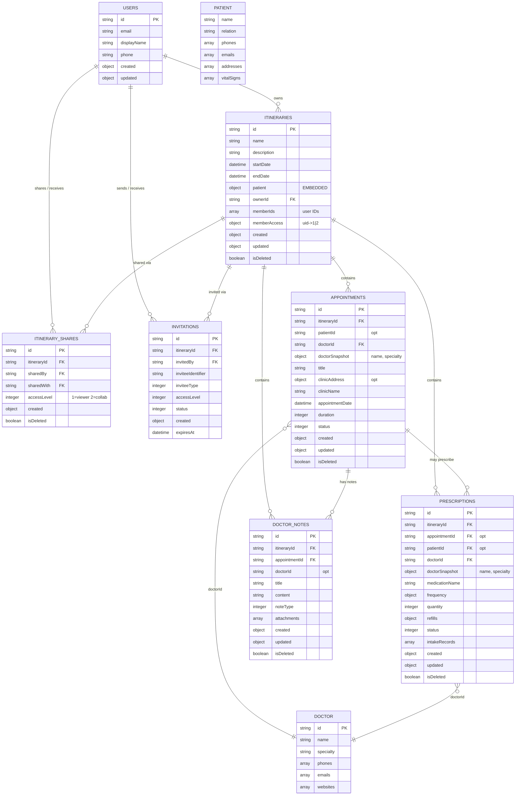

# Project Docto – Object relationships

## Entity relationship diagram (Mermaid)

## Relationship summary

| From            | To               | Type      | Field(s) |
|-----------------|------------------|-----------|----------|
| Itinerary       | Patient          | embedded  | `patient` |
| Itinerary       | User             | reference | `ownerId`, `memberIds`, `memberAccess` |
| Appointment     | Itinerary        | reference | `itineraryId` |
| Appointment     | Patient          | reference | `patientId` (optional) |
| Appointment     | Doctor           | reference | `doctorId`; snapshot `doctorSnapshot` (name, specialty) |
| Prescription    | Itinerary        | reference | `itineraryId` |
| Prescription    | Appointment      | reference | `appointmentId` (optional) |
| Prescription    | Doctor           | reference | `doctorId`; snapshot `doctorSnapshot` (name, specialty) |
| Doctor Note     | Itinerary        | reference | `itineraryId` |
| Doctor Note     | Appointment      | reference | `appointmentId` |
| Doctor Note     | Doctor           | reference | `doctorId` (optional) |
| Itinerary Share | Itinerary, User  | reference | `itineraryId`, `sharedBy`, `sharedWith` |
| Invitation      | Itinerary, User  | reference | `itineraryId`, `invitedBy` |

## Access model

- **Itinerary**: access by `memberIds`; write allowed only if `memberAccess[uid] === 2` or user is owner (`created.by`). `1` = viewer, `2` = collaborator.
- **Appointments, Prescriptions, Doctor notes**: same as parent itinerary (inherit permissions).
